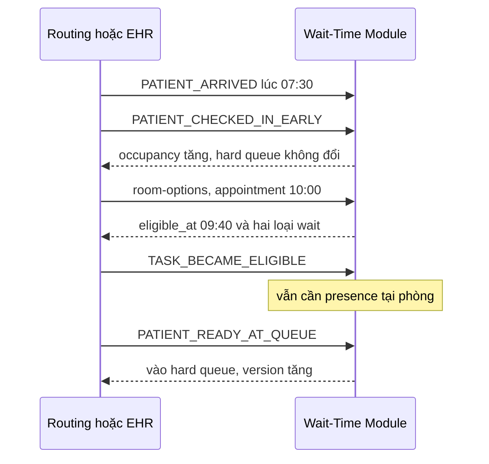
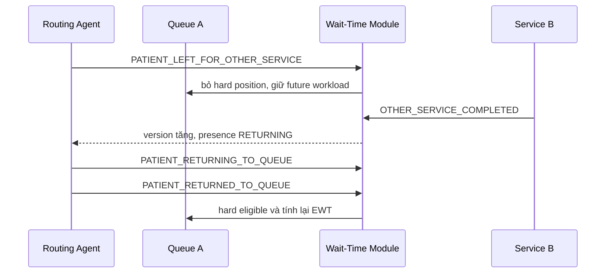

# Early arrival và cross-room flow

`physical_arrival_at` chỉ cho biết bệnh nhân ở bệnh viện. `eligible_at` là thời điểm sớm nhất được xét; `ready_at` cùng presence xác nhận bệnh nhân thực sự ở phòng. Vì vậy đến sớm tăng physical occupancy nhưng không tăng operational workload hoặc tạo lợi thế queue.

Với appointment, demo dùng `eligible_at=max(checkin_at, appointment_start-DEFAULT_EARLY_CHECKIN_WINDOW_MINUTES)`. Hard queue còn yêu cầu dependencies completed và presence `READY_AT_ROOM`/`ARRIVED_AT_ROOM`.

Backlog là tổng remaining service duration của eligible unfinished task từ window trước. Scheduler vẫn chạy heap đa tài nguyên, không lấy occupancy hoặc queue length nhân average duration.

Task ở phòng khác có presence `IN_OTHER_SERVICE`: không giữ resource, không hard-block, không bị no-show, nhưng Monte Carlo lấy mẫu completion/return và giữ trong `future_task_count`. Chỉ return/ready event mới làm hard eligible.

No-show chỉ được xác nhận khi task đủ điều kiện, không ở service khác, đã missed call và hết grace hoặc có xác nhận nghiệp vụ rõ ràng. Demo chạy bằng `scripts/demo_early_arrival_cross_room.py`.

Giới hạn server: migration hiện là local JSON normalization; cache là in-process; distribution là synthetic; chưa test nhiều worker, PostgreSQL server, Redis hay distributed ordering.
